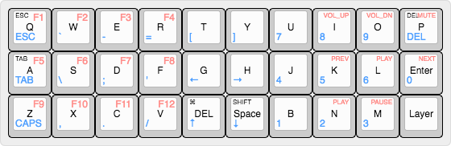

# gherkin-mac-keymap

My keymap for the Gherkin keyboard, optimized for use on a Mac computer

### Usage

1. Copy `macmap` and its contents into `qmk_firmware/keyboards/gherkin/keymaps`
2. From the qmk root, compile keymap and flash automatically by running:

        make gherkin:macmap:avrdude

### Keymap

Top left labels are mod keys, either double tap or mod-keys (_mod_ when held, _key_ when pressed).

 denote layer 1 keys

 denote layer 2 keys

[Interactive keymap](http://www.keyboard-layout-editor.com/#/gists/9d3a88a1c25779eb1e1ab27d1a2b4267)

### Reference 

Refer to the original [QMK Gherkin source](https://github.com/qmk/qmk_firmware/tree/master/keyboards/gherkin) for additional information.