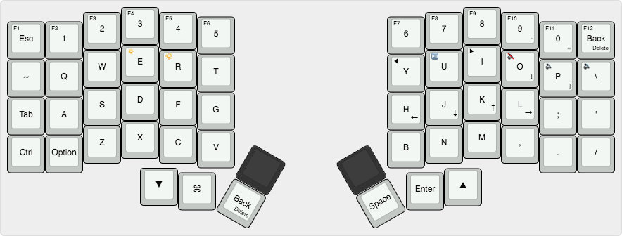

## Iris layout

Custom layout for my Iris keyboard. Focused for programming on a Mac.

### Usage

1. Copy `macmap` and its contents into `qmk_firmware/keyboards/orthodox/keymaps`

2. From the qmk root, compile keymap and flash automatically by running:

     make orthodox/rev1:macmap:avrdude

### Keymap

[Interactive keymap](http://www.keyboard-layout-editor.com/#/gists/98b578d90ebc699eaa30546a98a3ad6a)

### Reference 

Refer to the original [QMK Iris source](https://github.com/qmk/qmk_firmware/tree/master/keyboards/iris) for additional information.